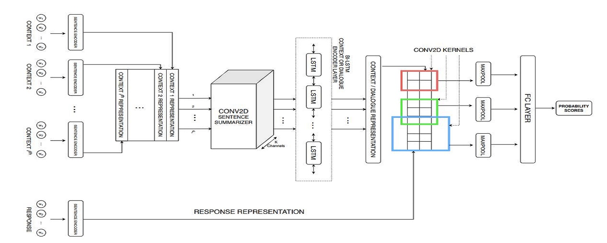

<div style="display: flex; justify-content: space-around; align-items: center;">
  
</div>

## 📜 paper-hbert-sarcasm-detection
#### 📌 Summary 
Implementation of the paper : 
**["A Novel Hierarchical BERT Architecture for Sarcasm Detection"](https://aclanthology.org/2020.figlang-1.14.pdf)** using **Python**, **Pandas**, **NumPy**, **Kaggle** and **TensorFlow**.

#### 🧠 Overview
This project implements a Hierarchical BERT (H-BERT) architecture for sarcasm detection in text, inspired by the paper **"A Novel Hierarchical BERT Architecture for Sarcasm Detection".** Unlike traditional sentiment analysis tasks, sarcasm detection often requires understanding multi-sentence context and subtle cues. This hierarchical model addresses that by processing text at both the sentence and context level using a 5 layered architecture that includes (1) sentence encoding, (2) context summarization with Conv1D, (3) a bi-directional LSTM for capturing temporal dependencies, (4) CNN layers for local feature extraction, and a (5) final fully connected layer for classification.

The model is trained on the "Sarcasm on Reddit" dataset from Kaggle rather than the dataset used in the original paper. Preprocessing includes data cleaning and dimensionality reduction. Tokenization is done using the BERT-base-uncased tokenizer from Hugging Face. Evaluation is performed using accuracy as the primary metric, and the entire model is implemented in Python using TensorFlow.

#### 🎯 Use Cases 
- Detecting Sarcasm on social media platforms

#### 🟢 Project Status
- Current Version: V1.0
- Completed

#### 📂 Repository Structure
```
paper-hbert-sarcasm-detection/
├── README.md
├── LICENSE
├── .gitignore                  
├── assets/                      
│   └── images/
├── datasets/                      
│   └── raw/
├── notebooks/               
│   └── sarcasm-analysis.ipynb            
└── paper/                   
    ├── paper.pdf
    └── citation.bib
```


### ✨ Features
- ✅ Custom `HierarchicalBERT` model class
- ✅ Preprocessed Data
- ✅ Sentence tokenization and padding
- ✅ Evaluation metrics: Accuracy, Precision, Recall, F1-score

🛠️ In progress:
▫️ Modification of H-bert Architecutre 

<!--
### 🎥 Demo
 <a href="https://www.youtube.com/shorts/wexIv6X45eE?feature=share" target="_blank">
  
</a> 
-->

### 🚀 Getting Started
#### 📚 Knowledge & Skills Required 
- Python programming
- ML/DL fundamentals, Transformers, Hugging Face Hub
- Neural Network Arhitecutres (CNN, LSTM, RNN, BERT)

#### 💻 Software Requirements
- IDE (VS Code) or jupyter notebook or google colab
- Best run on Kaggle using GPU P100
- Python 3
  
#### 🛡️ Tech Stack
- Language: python
- NLP/ML/LLM: transformers, huggingface_hub, sklearn, pandas, numpy
- Deep Learning: pytorch, CNN, LSTM, transformers-models (bert-base-uncased) 
- Visualization: matplotlib

#### 🔍 Modules Breakdown
<b> 📥 (1) Data-Preprocessing :</b> wh 
- Using a different Dataset than what was used on paper
- Loading [Sarcasm on Reddit](https://www.kaggle.com/datasets/danofer/sarcasm?select=train-balanced-sarcasm.csv) from kaggle 
- Dimention Reduced, Data Cleaned

<b> 🎭 (2) Tokenization :</b> basi
- Used **'bert-base-uncased'** model from hugging face for tokenization
- Tokenized "comment" column

<b> 🤖 (3) Heirarchial-BERT :</b> 
- The proposed H-BERT Architecture proposed in the paper and implemented in code is explained beiefly. The model consists of **5 layers** :-
  1. **(L-1) Sentence Encoding Layer**  
     - Encode input data into fixed sized vectors
  2. **(L-2) Context Summarization Layer**  
     - Convert the indvidual sequence-embeddings from layer-1 to common single-vect
     - **Conv1d sentence-summarizer layer** : Paper used Conv2d as their data 1.3B but we use only 30k so we use Conv1d
  3. **(L-3) LSTM - Context Encoder Layer**  
     - Implement a bi-direc LSTM to capture temporal dependencies from summ-sent layer-2
     - Bi-direc LSTM process data in both forward & backward direc, makes capturing v. easy
  4. **(L-4) CNN Layer**  
     - Extracts local features from encoded context vectors of layer-3
     - Try to emphasis significant features relavant to model and 
     - Give less attn to irrelavant features
     - **Kernel-layer**  : We use Conv1d kernels instead of Conv2d, also called cnn-filters
     - **Pooling-layer** : Use max pooling to extract imp features
  5. **(L-5) FFN / Fully Connected dense-net Layer**  
     - Proecess the model to give a final output 
     - Maps features to final predictions.

- The DataFlow:- 
(L-1) output --> (L-2) output --> (L-3) output --> (L-4) output --> (L-5) output --> predictions (0 or 1)

<b> 📈 (4) Model Evaluation :</b> shows
- Using 'Accuracy' Meterics to evaluate model performance

##### 📊 Evaluation
- Using 'Accuracy' Meterics to evaluate model performance
- Future work : precision , recall , f1

#### ⚙️ Installation
```
git clone https://github.com/pointer2Alvee/paper-hbert-sarcasm-detection.git
cd hbert-sarcasm-detection

# Recommended: Use a virtual environment
pip install -r requirements.txt
```

##### 🖇️ requirements.txt (core packages):
```
transformers==4.44.0
huggingface_hub==0.24.5
pandas
numpy
tensorflow
matplotlib
```

##### 💻 Running the App Locally
1. Open Repo in VS code / Kaggle (recommended)
2. Run Command
3. See accuracy

#### 📖 Usage
- Open VS Code / kaggle 
### 🧪 Sample Topics Implemented
- ✅ Web Scraping
- ✅ BERT model & NER model
- ✅ Theme Classifier, Character Relationship Network
  
- ⏳ Upcoming  : Chatbot, Text Classifier

### 🧭 Roadmap
- [x] Full attack classifier with fine-tuned DistilBERT


### 🤝 Contributing
Contributions are welcomed!
1. Fork the repo. 
2. Create a branch: ```git checkout -b feature/YourFeature```
3. Commit changes: ```git commit -m 'Add some feature'```
4. Push to branch: ```git push origin feature/YourFeature```
5. Open a Pull Request.

### 📜License
Distributed under the MIT License. See LICENSE.txt for more information.

### 🙏Acknowledgements
- Special thanks to the open-source community / youtube for tools and resources.
